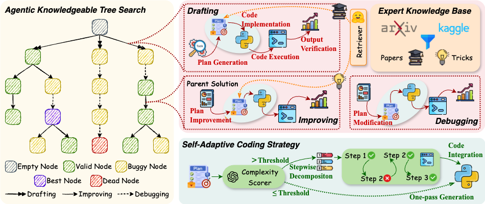

<div align="center">
<h2 align="center">AutoMind: Adaptive Knowledgeable Agent for Automated Data Science</p>

---

</div>

​**AutoMind**​ is an advanced LLM agent framework that automates end-to-end machine learning pipelines by dynamically integrating domain expertise, strategic solution exploration, and adaptive code generation. Unlike rigid workflow-based agents, AutoMind mimics human practitioners' empirical insights to solve complex, real-world data science challenges.

> [!IMPORTANT]
> Due to some variance in the results from a single run, **multiple runs are recommended** for more reliable performance.

​🏆 **AutoMind**​ was evaluated on two automated data science benchmarks using different foundation model families. Our results demonstrate superior performance over baselines on both benchmarks: 
1. On the OpenAI's [MLE-bench](https://arxiv.org/pdf/2410.07095), AutoMind surpassed ​61.0%​​ of human participants - representing a ​9.7% improvement​ over prior state-of-the-art (AIDE).
2. Comprehensive efficiency analysis revealed ​300% increased efficiency and ​63% lower token costs​ compared to previous SOTA approaches.

✨ More specifically, **AutoMind** revolutionizes automated data science with these breakthrough features:  
1. **An expert knowledge base for data science**: Curated from domain expertise to ground the agent in empirical best practices, overcoming LLMs' inherent lack of human practitioner experience. This enables handling of complex, innovative tasks beyond classical problems.  
2. **An agentic knowledge tree search algorithm**: Strategically explores solution spaces through a structured search approach, dynamically navigating possible paths to optimize problem-solving efficiency and effectiveness.  
3. **A self-adaptive coding strategy**: Dynamically adjusts code generation complexity based on task requirements, moving beyond rigid workflows to deliver context-aware implementations—from simple scripts to cutting-edge solutions.


## 🌟Overview

AutoMind revolutionizes LLM-driven data science automation by overcoming rigid workflows with three breakthroughs:  

🔍 **Expert Knowledge Base**  
Aggregates human expertise from 455 Kaggle competitions (3,237 top solutions) and top-tier research papers via intelligent hierarchical labeling.

> [!Note]
> Solutions from the same task as the test task will be identified and discarded after knowledge recall to **prevent the agent from plagiarism**.

Dynamically explores solutions through drafting/improving/debugging cycles, generating validated plan-code-metric nodes.  

⌨️ **Self-Adaptive Coding**  
Generates single-pass code for simple tasks vs. Abstract Syntax Tree(AST) verified stepwise execution for complex pipelines.  



## 📦Runtime

You can find the full datasets (data), experiment logs, solutions, and intermediate results in the complete runtime package, available from the header link or directly here: https://drive.google.com/drive/folders/1pyZXWPYR262NIXCrzD2NWpJHbdgiLRFR?usp=drive_link

Automind_runtime contains (approximate sizes):
- data (~33G): Full datasets required to run the tasks, equivalent to the output of running mlebench prepare --automind.
- runs (~179G): Complete runtimes for AutoMind and variants/baselines:
  - automind, automind_o3_mini (AutoMind with o3-mini as base model), automindwo_knowledge (AutoMind without the knowledge module)
  - aide_v3 and aide_o3_mini baselines
  Each includes logs, submissions, solution code, and time-stamped intermediate results.
- traj (~197M): For each runtime, the extracted trajectory of iterations from the root node to the best-performing node.

Overall size of the complete runtime package: ~212G.

## 🔧Environment Setup

### MLE-Bench

To prepare MLE-Bench, you should first install `mlebench` with pip:

```
conda create -n automind python=3.11
conda activate automind
cd mle-bench
pip install -e .
```

Some MLE-bench competition data is stored using Git-LFS. Once you have downloaded and installed LFS, run:

```
git lfs fetch --all
git lfs pull
```

[Kaggle API]((https://github.com/Kaggle/kaggle-api)) is used to download the raw datasets. Ensure that you have downloaded your Kaggle credentials (kaggle.json) and placed it in the ~/.kaggle/ directory (this is the default location where the Kaggle API looks for your credentials).

The original MLE-bench dataset is a collection of 75 Kaggle competitions, which is a particularly resource-intensive benchmark to run. A single run of the original experiment setup of 24 hours per competition attempt requires 24 hours × 75 competitions = 1800 GPU hours of compute. Furthermore, running agents for the whole duration is very token-intensive.

Alternatively, you can download the [subset](mle-bench/experiments/splits/automind.txt) of MLE-Bench which consists of 15 competitions used in our experiments via the following scripts:

```
mlebench prepare --automind 
```

To download and prepare the original MLE-bench dataset, run the following, which will download and prepare the dataset in your system's default cache directory.

```
mlebench prepare --all
```

You can also prepare the dataset for a specific competition by
running:

```
mlebench prepare -c <competition-id>
```

### Docker Sandbox

The code implementation and execution stage of AutoMind is designed to run in a Docker sandbox for security and reproducibility. If you want to run AutoMind locally on your machine, you need to set up the following prerequisites: 
- Install [Docker](https://docs.docker.com/engine/install/)
- Install [Sysbox](https://github.com/nestybox/sysbox)
- Install [NVIDIA Container Toolkit](https://docs.nvidia.com/datacenter/cloud-native/container-toolkit/install-guide.html) to run agents with GPUs

#### Base Environment

We first build a base Docker image by running:

```
bash scripts/build_base_env.sh
```

This will create a Docker image named `automind-base` with the necessary dependencies installed. Every time you want to update the base environment, you can run this script again to rebuild the image. To remove the dangling images not used, you can run the following command:

```
docker rmi -f $(docker images -f "dangling=true" -q)
```

### Embedding Model

We adopt [all-MiniLM-L6-v2](https://huggingface.co/sentence-transformers/all-MiniLM-L6-v2) as our embedding model for knowledge retreivel, you should download it from huggingface and put it at `automind/backend/all-MiniLM-L6-v2`.

## ⏩Running

To run AutoMind on MLE-Bench, you need to set the environment variables in `configs/mlebench.yaml` first (e.g. `OPENAI_API_KEY` and `OPENAI_BASE_URL`). You can also specify any other environment variables required for code execution.

Then you should replace `/path/to/data` with the actual path to the MLE-Bench dataset in `scripts/run_mle_bench.sh`. To speify the set of competetions to run, you should set `--competition-set` as the path to the files in the `experiments/splits/` directory.
You can also specify the GPU device you want to use by setting the `--gpu-device` argument.

Then you should run the following command:

```
bash scripts/run_mle_bench.sh
```

This script will build both the Docker image and container for AutoMind, then run the agent on the MLE-Bench dataset. The results will be saved in the mle-bench/logs directory.

## 🌻Acknowledgement

Our code for Agentic Knowledgeable Tree Search is built on top of [aideml](https://github.com/WecoAI/aideml/) framework. Our code for evaluation is implemented based on OpenAI's [mle-bench](https://github.com/openai/mle-bench). We thank all authors for their great contributions!
